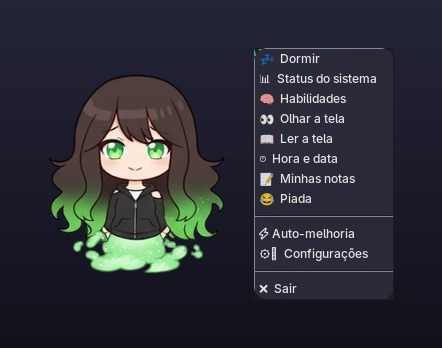

<h1 align="center">Shimeji</h1>

<p align="center">
  Assistente de desktop que mora na sua tela: ouve por voz, olha o seu código e evolui com o uso.<br>
  Python puro com Tkinter — sem Electron, sem servidor, sem build.
</p>

<p align="center">
  
  
  
  
  
  
</p>

<p align="center">
  
</p>

<p align="center">
  
  
</p>

---

## Sumário

- [O que ela faz](#o-que-ela-faz)
- [Veja rodando](#veja-rodando)
- [Instalação](#instalação)
- [Como rodar](#como-rodar)
- [Comandos de voz](#comandos-de-voz)
- [Expressões](#expressões)
- [Escrevendo habilidades](#escrevendo-habilidades)
- [Auto-evolução](#auto-evolução)
- [Arquitetura](#arquitetura)
- [Testes](#testes)
- [Segurança](#segurança)
- [Solução de problemas](#solução-de-problemas)
- [Licença](#licença)

---

## O que ela faz

A Shimeji fica flutuando sobre as suas janelas. Você fala, ela executa.

| | |
|---|---|
| 🎤 **Voz** | Escuta o microfone em português e interpreta o comando localmente, sem mandar tudo para a nuvem |
| 👀 **Visão** | Tira um print e manda para um modelo de visão: descreve a tela ou faz code review do que está aberto |
| 🧠 **Mentora** | Fora dos comandos nativos, conversa como engenheira sênior — arquitetura, Clean Code, SOLID, testes |
| 📝 **Memória** | Notas, XP, nível e afeto sobrevivem ao fechamento e entram no contexto da IA |
| ⏱️ **Alarmes** | "me avisa em 10 minutos" e ela treme na tela na hora certa |
| 🖥️ **Controle** | Abre sites e programas, encerra processos, ajusta volume, relata CPU/RAM/disco/bateria |
| 🔌 **Plugins** | Qualquer `.py` na pasta `habilidades/` vira um comando novo |
| 💤 **Hibernação** | Desliga o microfone e as animações para poupar bateria |

## Veja rodando

Sem instalar nada, dá para ver o roteiro completo: o modo `--demo` roda uma sequência
fixa de comandos, sem microfone e sem rede.

```bash
python3 main.py --demo
```

<details>
<summary><strong>Saída real do <code>--demo</code></strong> (clique para abrir)</summary>

```text
Shimeji: Boa noite, polar! Shimeji online.

[demo] Você: oi shimeji
Shimeji: Opa polar! Bora codar?

[demo] Você: que horas são
Shimeji: São 22:31. Hoje é domingo, 06/09/2026.

[demo] Você: calcula 25 vezes 4 mais 10
Shimeji: O resultado é 110.

[demo] Você: anota pra mim: revisar o pull request
Shimeji: Anotado: revisar o pull request

[demo] Você: minhas notas
Shimeji: Você tem 1 nota.
Shimeji: 06/09/2026 22:31: revisar o pull request

[demo] Você: conta uma piada
Shimeji: Quantos programadores são necessários pra trocar uma lâmpada? Nenhum, isso é problema de hardware.

[demo] Você: status do sistema
Shimeji: CPU em 10 por cento. RAM em 51 por cento, 8.4 de 16.5 gigas. Disco em 61 por cento, 290.1 de 501.9 gigas.

[demo] Você: volume 40
Shimeji: Volume em 40 por cento.

[demo] Você: alarme em 3 segundos
Shimeji: Alarme marcado para daqui a 3 segundos.
Shimeji: O tempo acabou! Passaram 3 segundos.

[demo] Você: executa motivacao
Shimeji: Executando motivacao.
Shimeji: Todo código tem bugs; o importante é não desistir de debugar.

[demo] Você: o que você sabe fazer
Shimeji: Sei abrir programas e sites, pesquisar, fechar processos, olhar e ler a sua tela, dar o status
do sistema, controlar o volume, dizer as horas, criar alarmes, guardar notas, calcular, ver o clima e
contar piadas.
Shimeji: Habilidades aprendidas: exemplo, filosofiadaverdade, motivacao, pomodoro.
```

</details>

Passe o mouse por cima dela para ver o status flutuante:

<p align="center">
  
</p>

## Instalação

Precisa de **Python 3.10 ou mais novo** e de uma sessão gráfica.

```bash
git clone https://github.com/blackxzin/shimeji-ia-.git
cd shimeji-ia-

python3 -m venv venv
source venv/bin/activate        # Windows: venv\Scripts\activate

pip install -r requirements.txt
```

**Tkinter** vem junto com o Python no Windows e no macOS. No Linux é um pacote à parte:

```bash
sudo apt install python3-tk      # Debian, Ubuntu
sudo pacman -S tk                # Arch
sudo dnf install python3-tkinter # Fedora
```

**Microfone** (opcional — sem ele a Shimeji funciona pelo menu do botão direito):

```bash
pip install PyAudio
sudo apt install portaudio19-dev python3-pyaudio   # Linux, se o pip falhar
```

**Captura de tela no Linux.** Em sessões Wayland o Pillow não consegue capturar;
instale `grim`. Em X11, `scrot` ou `maim` resolvem.

```bash
sudo pacman -S grim        # Wayland
sudo apt install scrot     # X11
```

## Como rodar

```bash
python3 main.py            # ou: python3 -m shimeji
```

Para a IA funcionar você precisa de uma chave da [Groq](https://console.groq.com/keys)
(o plano gratuito já dá conta). Configure de um destes jeitos:

```bash
export GROQ_API_KEY="sua-chave"     # variável de ambiente
python3 main.py --api-key sua-chave # argumento
```

Ou clique com o botão direito nela → **⚙️ Configurações** e cole a chave. Ela fica
salva em `memoria.json`, que já está no `.gitignore`.

### Opções de linha de comando

| Flag | Padrão | Para quê |
|---|---|---|
| `--api-key CHAVE` | `GROQ_API_KEY` ou `memoria.json` | Chave da API Groq |
| `--modelo NOME` | `llama-3.3-70b-versatile` | Modelo de texto |
| `--modelo-visao NOME` | `meta-llama/llama-4-scout-17b-16e-instruct` | Modelo de visão |
| `--sem-voz` | desligado | Desativa a fala (só imprime no terminal) |
| `--sem-microfone` | desligado | Não abre o microfone |
| `--demo` | desligado | Roteiro automático, sem microfone e sem rede |
| `--permitir-auto-modificacao` | desligado | Libera a IA para reescrever o próprio código |

## Comandos de voz

Tudo em português, em linguagem natural. O que não casar com um comando nativo vai
para a IA como conversa.

| Diga | Ela faz |
|---|---|
| *"abre o youtube"* · *"abre o firefox"* | Abre site, arquivo ou programa |
| *"pesquisa clean architecture"* | Busca no Google |
| *"fecha o spotify"* | Encerra o processo (com lista de protegidos) |
| *"olha a tela"* · *"analisa esse código"* | Print + análise por visão computacional |
| *"lê a tela"* | Extrai o texto da tela (OCR) |
| *"status do sistema"* | CPU, RAM, disco e bateria |
| *"volume 40"* | Ajusta o volume principal |
| *"que horas são"* | Hora e data por extenso |
| *"me avisa em 10 minutos"* | Alarme com tremor na tela |
| *"anota pra mim: subir o deploy"* | Salva uma nota persistente |
| *"minhas notas"* | Lê as notas guardadas |
| *"calcula 25 vezes 4"* · *"quanto é 15% de 200"* | Calculadora segura |
| *"clima em Curitiba"* | Previsão do tempo |
| *"conta uma piada"* | Piada de programador |
| *"dorme"* / *"acorda"* | Liga e desliga o microfone |
| *"executa pomodoro"* | Roda uma habilidade da pasta `habilidades/` |

Também dá para clicar: **clique** para uma reação, **duplo clique** para fazer carinho
(sobe o afeto), **arrastar** para mover, **botão direito** para o menu.

## Expressões

<p align="center">
  
</p>

<p align="center">
  <sub>normal · feliz · brava · triste · piscando</sub>
</p>

## Escrevendo habilidades

Qualquer arquivo `.py` dentro de `habilidades/` que exponha `executar()` vira um comando
de voz — nada de registrar em lugar nenhum. Diga *"executa nome_do_arquivo"*.

```python
# habilidades/cafe.py
def executar(shimeji=None):
    if shimeji is None:          # rodando fora da Shimeji
        print("Hora do café!")
        return

    shimeji.set_mood("feliz")
    shimeji.falar(f"Hora do café, {shimeji.memoria.nome_user}!")
    shimeji.pular()
    shimeji.ganhar_xp(3)
```

O parâmetro `shimeji` é opcional. Declarando-o, você recebe esta API pública:

| Método | O que faz |
|---|---|
| `falar(texto)` | Fala e imprime no terminal |
| `set_mood(humor, voltar_em_ms=4000)` | Troca a expressão (seguro em qualquer thread) |
| `pular(vezes=1)` · `tremer(vezes=6)` | Animações |
| `ganhar_xp(quantidade)` | Concede XP e devolve o nível |
| `anotar(texto)` | Salva uma nota persistente |
| `memoria` | Nome, XP, afeto, notas e histórico |
| `parar_evento` | `threading.Event` sinalizado no encerramento — cheque antes de tarefas longas |

Habilidades com erro de sintaxe são recusadas na carga e registradas no terminal, sem
derrubar as outras. A Shimeji também sabe escrever habilidades sozinha: peça *"cria uma
habilidade que..."* e ela gera, valida e carrega o arquivo.

## Auto-evolução

A Shimeji consegue reescrever o próprio código-fonte. **É desligado por padrão** e só
liga com `--permitir-auto-modificacao`. Mesmo ligado, toda proposta passa por:

1. Sanitização do nome da função
2. Rejeição de construções perigosas (`exec`, `eval`, `subprocess`, `os.system`, `shutil.rmtree`, escrita em arquivo, `socket`)
3. Validação de sintaxe do bloco isolado
4. Compilação do arquivo inteiro em um temporário
5. Backup com timestamp antes de gravar
6. Registro em `historico_melhorias.jsonl`

Se qualquer etapa falhar, o arquivo original não é tocado.

## Arquitetura

Um módulo por responsabilidade. A lógica pura (comandos, cálculo, memória) não conhece
Tkinter, então dá para testá-la sem abrir janela.

```
shimeji/
├── app.py           # orquestrador: liga interface, voz, IA, memória e plugins
├── comandos.py      # fala → Intencao (regex + roteamento, sem efeito colateral)
├── calculadora.py   # avaliador aritmético por AST, sem eval
├── memoria.py       # persistência atômica de perfil, XP e notas
├── sistema.py       # abrir, encerrar, volume e telemetria (fronteira de segurança)
├── ia.py            # cliente Groq, prompt de sistema e parsing das respostas
├── tela.py          # captura multiplataforma (Pillow, grim, scrot, maim…)
├── voz.py           # TTS em fila de thread única + STT
├── ui.py            # janela, sprites, animações e diálogos
├── evolucao.py      # auto-modificação com trava, backup e validação
├── habilidades.py   # carregador de plugins
├── textos.py        # falas, piadas e roteiro da demo
└── config.py        # constantes e parsing de linha de comando
```

Duas regras estruturam o resto:

**Nenhuma thread toca em widget.** As threads de voz, alarme e monitoramento publicam
funções em um `Despachante`, drenado dentro do laço do Tk. Chamar `root.after()` de fora
da thread principal é corrida contra o interpretador Tcl.

**Toda entrada de voz é hostil até prova em contrário.** O que vem do microfone passa
por `comandos.py` antes de chegar em `sistema.py`, e ali nada é interpretado por shell.

## Testes

```bash
pip install -r requirements-dev.txt
python3 -m pytest                              # 332 testes
python3 -m pytest --cov=shimeji --cov-report=term-missing
```

Os testes de interface precisam de sessão gráfica e são pulados sem ela. Em CI, use
`xvfb-run -a python -m pytest`.

| Módulo | Cobertura |
|---|---|
| `config.py` · `textos.py` | 100% |
| `comandos.py` | 97% |
| `tela.py` · `ia.py` | 96% |
| `evolucao.py` · `habilidades.py` | 95% |
| `memoria.py` | 93% |
| `ui.py` | 91% |
| `sistema.py` | 87% |
| `calculadora.py` | 86% |
| `app.py` | 83% |
| **Total** | **89%** |

Os scripts de `scripts/` regeneram as imagens deste README a partir da aplicação real:

```bash
python3 scripts/gerar_capturas.py   # docs/preview-*.jpg
python3 scripts/gerar_gif.py        # docs/demo.gif
```

## Segurança

A Shimeji executa o que ouve, então estas travas não são opcionais:

- **Sem shell.** Programas são abertos por lista de argumentos. Alvos com `;`, `&&`, `` ` `` ou redirecionamento são recusados antes de chegar ao executor.
- **Sem `eval`.** A calculadora percorre a AST nó a nó, aceita só operadores e funções de uma lista fixa, e limita expoentes para que `9**9**9` não trave o processo.
- **Processos protegidos.** `fecha X` nunca encerra a própria Shimeji, o `systemd`, o servidor gráfico ou o shell da sessão, e recusa nomes com menos de 3 caracteres.
- **Auto-modificação desligada** por padrão, com validação em camadas e backup quando ligada.
- **Plugins isolados.** Erro em habilidade não derruba a aplicação.
- **A chave da API** fica em `memoria.json`, ignorado pelo Git, e nunca aparece no terminal.

## Solução de problemas

<details>
<summary><strong>Aparece um retângulo em volta dela no Linux</strong></summary>

O atributo `-transparentcolor` do Tk só existe no Windows. Em Linux e macOS a Shimeji
recorta o sprite pela caixa do canal alfa para reduzir a moldura ao mínimo, mas ela não
some por completo. É limitação do Tk, não bug da aplicação.
</details>

<details>
<summary><strong>"Não consegui capturar a tela"</strong></summary>

Sessão Wayland sem ferramenta de captura. Instale `grim` (Wayland) ou `scrot`/`maim` (X11).
</details>

<details>
<summary><strong>O microfone não é encontrado</strong></summary>

Falta o PyAudio. Instale com `pip install PyAudio` (no Linux, `portaudio19-dev` antes).
Sem microfone ela continua utilizável pelo menu do botão direito, ou rode com `--sem-microfone`
para não ver o aviso.
</details>

<details>
<summary><strong>Ela não fala nada</strong></summary>

O `pyttsx3` usa `espeak` no Linux: `sudo apt install espeak` ou `sudo pacman -S espeak-ng`.
Com `--sem-voz` as falas saem só no terminal.
</details>

<details>
<summary><strong>"API Groq não configurada"</strong></summary>

Os comandos nativos funcionam sem chave; só conversa, visão e OCR precisam dela.
Pegue uma em [console.groq.com/keys](https://console.groq.com/keys).
</details>

## Licença

[MIT](LICENSE).

Os sprites em `assets/` são arte do projeto; se você for reutilizá-los fora daqui,
combine com a autoria antes.
